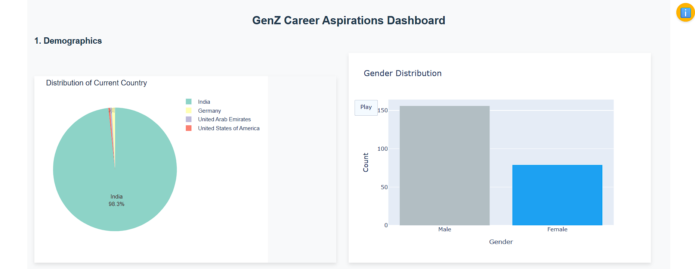
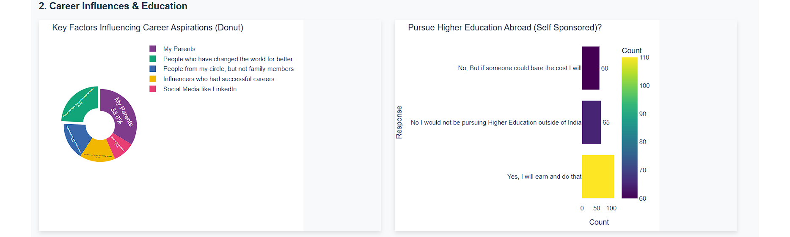
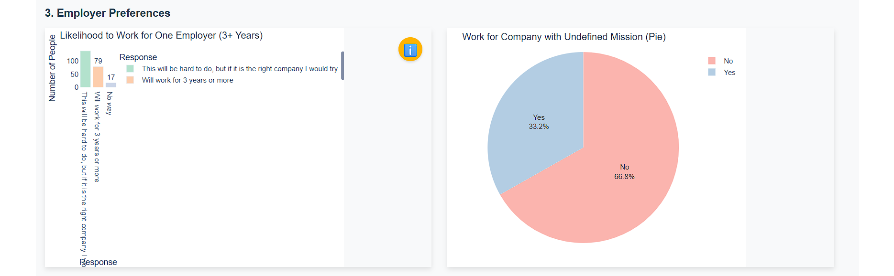
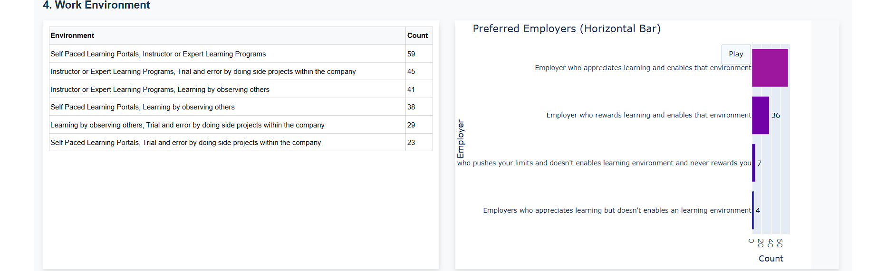

# GenZ Career Aspirations Dashboard
# 🚀 Interactive Dash Analytics Dashboard

An interactive and animated analytics dashboard built using **Plotly Dash**, showcasing real-time data visualizations, smooth animations, and modern UI components. Ideal for data analysts, business intelligence, and developers who want visually engaging dashboards.

---

## 📊 Features

- 🎨 Modern and colorful UI
- 📈 Real-time interactive graphs
- ✨ Animated transitions
- 📱 Responsive design
- ⚙️ Built with Python, Dash, and Plotly

---

## 🔧 Technologies Used

- Python 🐍
- Dash by Plotly 📊
- HTML/CSS for styling 🎨
- Dash Core Components and HTML Components.

---

## 🖼️ Demo Screenshots--

### 1️⃣ Demographics.


### 2️⃣ Career Influences & Education.


### 3️⃣ Employer Preferences.


### 4️⃣ Work Environment.


### 5️⃣ Career Aspirations.


This is a Dash application that visualizes GenZ career aspirations data.

## Local Development

1. Create a virtual environment:
```bash
python -m venv venv
```

2. Activate the virtual environment:
- Windows:
```bash
venv\Scripts\activate
```
- Unix/MacOS:
```bash
source venv/bin/activate
```

3. Install dependencies:
```bash
pip install -r requirements.txt
```

4. Run the application:
```bash
python aap.py
```

## Deployment on Render

1. Create a new Web Service on Render
2. Connect your GitHub repository
3. Use the following settings:
   - Build Command: `pip install -r requirements.txt`
   - Start Command: `gunicorn aap:server`
   - Python Version: 3.9.18

The application will be automatically deployed and available at your Render URL. 
